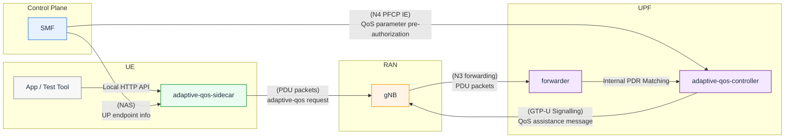
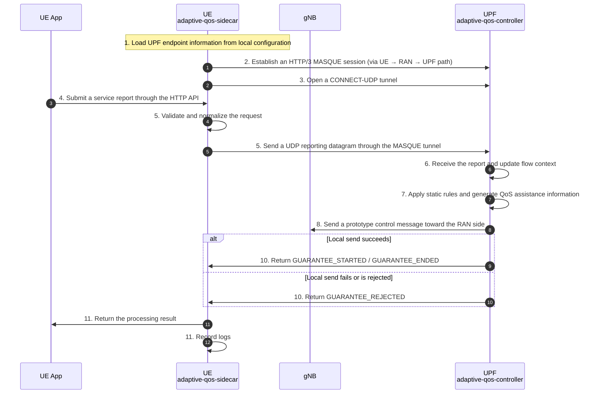

## 1. Objective
* **UE reports service intent or service changes → UPF derives QoS assistance information → UPF sends the assistance information toward the RAN side → UE receives guarantee start or end feedback**
## 2. Deployment Design

### 2.1 UE-side Component: `adaptive-qos-sidecar`
`adaptive-qos-sidecar` is a new process deployed on the UE side and implemented in **Go**. This component is not intended to function as a general-purpose traffic proxy. Instead, it is dedicated to service-semantic reporting and guarantee feedback handling. Its main functions are as follows:
* Expose an HTTP interface to local applications or test tools
* Establish an **HTTP/3-based MASQUE session** with the UPF-side collaboration module
* Use **CONNECT-UDP** to establish a UDP tunnel toward the UPF reporting endpoint
* Send service reporting datagrams through the MASQUE tunnel
* Receive guarantee feedback from the UPF and return it to the local caller
It should be emphasized that this tunnel must traverse the service PDU path:
* **UE → RAN → UPF**
### 2.2 UPF-side Component: `adaptive-qos-controller`
`adaptive-qos-controller` is a new collaboration control module deployed alongside or inside the UPF. Its main responsibilities are as follows:
* Terminate the MASQUE reporting tunnel from the UE-side `qos-sidecar`
* Receive and parse service reporting datagrams carried inside the tunnel
* Validate and normalize incoming payloads
* Maintain minimal per-session and per-flow context
* Generate QoS assistance information using a static rule table
* Send prototype control messages toward the RAN side
* Return guarantee status feedback to the UE side
## 3. End-to-End Flow
The end-to-end flow of this prototype is as follows:
1. `qos-sidecar` reads UPF endpoint information from a local configuration file.
2. `qos-sidecar` establishes an **HTTP/3 MASQUE session** with the UPF-side collaboration module.
3. `qos-sidecar` opens a **CONNECT-UDP** tunnel toward the UPF reporting target.
4. A local application or test tool submits a service reporting request to `qos-sidecar` through the HTTP API.
5. `qos-sidecar` validates and normalizes the request, encapsulates it into an application-defined datagram, and sends it to the UPF through the MASQUE tunnel.
6. The UPF matches the message through its internal PDR processing, passes it to the collaboration control module, and updates the corresponding session/flow context.
7. The UPF maps service semantics to QoS assistance information.
8. The UPF constructs a prototype control message and sends it toward the RAN side.
9. If the local send operation succeeds, this step is considered successful.
10. The UPF returns guarantee status feedback to `qos-sidecar` over the same MASQUE session.

## 4. Module Design
### 4.1 UE-side Module Design
The UE-side `qos-sidecar` is responsible for:
* Maintaining the MASQUE session with the UPF-side collaboration module
* Providing a local HTTP interface for service reporting
* Performing input validation and normalization for service reports
* Sending service reports to the UPF through the MASQUE tunnel
* Receiving and returning guarantee status feedback from the UPF
#### 4.1.1 External Interfaces
`qos-sidecar` provides the following HTTP APIs to local applications or test tools:
* `POST /report`: submit a new service report or an update to an existing service state
* `POST /end`: terminate a previously reported service request
* `GET /status`: query the connection status and the most recent UPF feedback result
* `GET /flows`: list managed sidecar flow state
* `GET /flows/{flowId}`: inspect one managed flow
* `GET /trace`: retrieve the bounded real-time sidecar trace backlog

Current sidecar implementation detail:
* The sidecar can keep a reported flow active by running a periodic keepalive loop.
* The local HTTP request may include `keepaliveInterval`; when set, the sidecar sends the initial `INTENT_REPORT` and then periodic `STATUS_REPORT` refreshes for that `flowId` until `POST /end` is called.
* If `keepaliveInterval` is omitted, the sidecar falls back to its configured default or runs the flow as one-shot if no default is configured.
* The sidecar maintains an in-memory bounded trace backlog so the demo can show live request, keepalive, feedback, and error events without relying only on stdout logs.
### 4.2 UPF-side Module Design
The UPF-side collaboration control module is responsible for:
* Terminating the MASQUE reporting path
* Receiving tunneled report messages from `qos-sidecar`
* Validating and normalizing payloads
* Maintaining minimal context organized by UE session and logical flow
* Executing rule-based QoS mapping
* Building prototype QoS assistance messages
* Sending prototype control messages toward the RAN side
* Returning guarantee results to `qos-sidecar`

### 4.3 UPF Routing Path for the MASQUE Connection
The MASQUE tunnel is not modeled as a special PFCP control path. It rides the normal UE PDU data path until the packet reaches a local UPF socket.

#### 4.3.1 UE to UPF MASQUE ingress path
For UE-originated MASQUE traffic, the routing path is:
1. The UE sends a packet addressed to the configured UPF MASQUE endpoint, for example `10.60.0.254:4433`.
2. The packet reaches the gNB over the UE PDU session and is forwarded to the UPF over N3 as a normal GTP-U uplink packet.
3. The userspace forwarder decapsulates GTP-U and performs normal uplink PDR matching.
4. PDR selection is based on the existing userspace datapath logic, primarily:
   * uplink TEID
   * UE IP
   * optional SDF filter conditions
   * PDR precedence
5. After PDR match, the existing FAR handling forwards the packet toward the core side as raw IP through the userspace TUN device.
6. Because the MASQUE endpoint IP is bound locally on the UPF TUN-side interface, the Linux IP stack delivers the packet to the local HTTP/3 MASQUE UDP socket.

Important note:
* PDR matching happens in the normal userspace forwarding pipeline before local socket delivery.
* The adaptive QoS controller itself does not perform PFCP rule lookup for the received socket payload.

#### 4.3.2 UPF to UE MASQUE feedback path
For feedback from the UPF back to the UE, the routing path is:
1. The adaptive QoS controller writes the response on the local MASQUE UDP socket.
2. The kernel routes the response packet toward the UE IP through the userspace TUN interface.
3. The userspace forwarder reads the packet from TUN and performs normal downlink PDR matching.
4. Downlink matching uses the existing userspace downlink lookup, primarily by UE IP and optional SDF filter match.
5. The selected FAR causes the packet to be encapsulated as GTP-U and sent back to the gNB over N3.
6. The gNB forwards the packet to the UE.

#### 4.3.3 Design consequence
This means the MASQUE transport is intentionally inserted into the real service path:
* inbound UE-to-UPF MASQUE traffic uses normal uplink PDR/FAR processing
* outbound UPF-to-UE feedback uses normal downlink PDR/FAR processing
* the adaptive QoS controller is reached as a local socket destination on the UPF-side UE subnet, not as an SBI endpoint and not as a separate PFCP-managed function

#### 4.3.4 Trace Backlog for Demonstration
For prototype demonstration, tracing is maintained on both ends:
* The UE sidecar exposes a bounded in-memory event backlog through `GET /trace`.
* The userspace UPF maintains a bounded adaptive QoS trace backlog in the userspace runtime snapshot.
* The UPF trace records controller start/stop, MASQUE request open/reject, report receive/decode, session binding, profile selection, profile apply, gNB send, feedback return, and rejection/error stages.
* The sidecar trace records local submission, transport send start/fail, keepalive ticks, feedback reception, flow management transitions, and local errors.
## 5. Interface and Message Design
### 5.1 Endpoint Configuration
In the first phase, UPF endpoint information is not dynamically delivered over NAS. Instead, it is stored in a local configuration file on the UE side.
If tighter control-plane integration is needed later, this can be evolved into a model where the CP delivers collaboration endpoint information.
### 5.2 UE → UPF Reporting Messages
#### 5.2.1 Message Types
* `INTENT_REPORT`
* `STATUS_REPORT`
* `END_REPORT`
#### 5.2.2 Control Fields
* `flowId`: an identifier allocated by the UE for each new logical flow
* `reportType`
* `timestamp`
#### 5.2.3 General Fields
* `trafficPattern`: for example periodic, background, or sporadic
* `expectedArrivalTime`
* `burstSize`
* `burstDuration`
#### 5.2.4 High-Reliability Service Fields
* `reliabilityLevel`
* `latencySensitivity`
* `packetLossTolerance`
#### 5.2.5 Video Service Fields
* `resolution`
* `bitrate`
* `frameRate`
### 6.3 UPF → RAN Prototype Control Message Design
This prototype does not require standards-compliant behavior on the RAN side. The UPF sends a **separate UDP control message** carrying a prototype-defined QoS assistance payload.
The QoS/Profile information that may be carried includes:
* 5QI / 6QI
* ARP
* GFBR
* MFBR
* Maximum Packet Loss Rate (UL / DL)
### 6.4 UPF → UE Feedback Message Design
UPF feedback to the UE is returned over the same MASQUE session, using the reverse direction of the same application-defined datagram exchange mechanism.
#### 6.4.1 Message Types
The following feedback types are supported:
* `GUARANTEE_STARTED`
* `GUARANTEE_ENDED`
* `GUARANTEE_REJECTED`
#### 6.4.2 Minimal Fields
The feedback message must contain at least the following fields:
* `flowId`
* `status`
* `reasonCode`
* `effectiveTime`
## 7. Rule Mapping
* The UPF should map inputs into dynamic QoS profile rules based on the UE’s QoS-related feedback, the pre-authorized QoS parameter range delivered by the CP (SMF), and the current network load. In the prototype, the pre-authorized range may be preconfigured, but the design should preserve the capability to deliver it through an extended N4 PFCP IE. Current network load may be stubbed or mocked.
* Example rules:
  * **Periodic control traffic + high latency sensitivity**
    Map to a low-latency QoS profile
  * **Known short burst + low packet-loss tolerance**
    Map to a short-duration assured-bitrate QoS profile
  * **Video bitrate increase event**
    Map to a higher downlink bitrate QoS profile
One thing to note: your section numbering has a small inconsistency in the source text. Under section 5, the later subsections are labeled `6.3` and `6.4`. In a cleaned-up English version, those would normally be `5.3` and `5.4`.

## 8. Concrete Implementation Plan
This section turns the prototype design into an execution plan for the current codebase.

Important implementation assumptions:
* Only `forwarder: userspace` is in scope.
* `gtp5g` must remain behaviorally unchanged.
* The UPF must both:
  * send the prototype QoS-assistance message toward the gNB side, and
  * apply the selected QoS profile to the local userspace datapath.
* MASQUE over HTTP/3 remains mandatory for this prototype and is not replaced with plain UDP.
* The pre-authorized QoS range is configuration-backed in the first version, but the design must preserve a clean extension point for future PFCP/N4 delivery.

### 8.1 Stage 0: Baseline and Design Lock
Goal: define the userspace-only architecture before implementation starts.

Checklist:
* [ ] Confirm that all adaptive QoS code is attached only to the userspace forwarder lifecycle.
* [ ] Define the ownership boundary between:
  * UE-side `adaptive-qos-sidecar`
  * UPF-side `adaptive-qos-controller`
  * existing userspace packet pipeline
* [ ] Define the transport boundary:
  * MASQUE server terminates in the UPF controller
  * existing SBI HTTP server is not reused for report transport
* [ ] Define session association strategy from MASQUE tunnel traffic to userspace session state.
* [ ] Define the adaptive flow key as `SEID + flowId`.
* [ ] Define success semantics:
  * local adaptive profile applied successfully
  * prototype gNB control UDP send succeeds
  * feedback returned on the same MASQUE session
* [ ] Define failure semantics:
  * invalid report -> reject
  * session bind failure -> reject
  * rule mapping failure -> reject
  * gNB send failure -> rollback and reject

Exit criteria:
* A single userspace-only architecture is agreed and no stage below needs to make product decisions.

### 8.2 Stage 1: UE-Side Sidecar Skeleton
Goal: establish the UE-originated control path and local app API.

Checklist:
* [ ] Create the `adaptive-qos-sidecar` process in Go outside this repo or in a paired prototype workspace.
* [ ] Add local HTTP APIs:
  * [ ] `POST /report`
  * [ ] `POST /end`
  * [ ] `GET /status`
* [ ] Add local config loading for:
  * [ ] UPF MASQUE endpoint
  * [ ] certificates or trust material
  * [ ] local listen address
* [ ] Implement request validation and normalization into a single internal report struct.
* [ ] Implement HTTP/3 client setup.
* [ ] Implement MASQUE `CONNECT-UDP` establishment.
* [ ] Implement datagram send/receive loop over the MASQUE session.
* [ ] Track last connection state and last feedback result for `GET /status`.

Exit criteria:
* The sidecar can connect to the UPF controller over HTTP/3 MASQUE and exchange prototype datagrams without involving adaptive mapping yet.

### 8.3 Stage 2: UPF Controller Skeleton in `forwarder: userspace`
Goal: add a userspace-only control module inside the UPF runtime.

Checklist:
* [ ] Add a new userspace-only adaptive QoS controller package.
* [ ] Start and stop the controller from the userspace driver lifecycle.
* [ ] Add config for:
  * [ ] MASQUE bind address
  * [ ] certificate and key paths
  * [ ] gNB prototype control UDP destination
  * [ ] static pre-authorization ranges
  * [ ] static rule table
* [ ] Implement HTTP/3 server startup and shutdown.
* [ ] Implement MASQUE `CONNECT-UDP` termination.
* [ ] Implement report datagram decoding.
* [ ] Implement feedback datagram encoding.
* [ ] Add controller-level logging and counters for:
  * [ ] tunnel established
  * [ ] report accepted
  * [ ] report rejected
  * [ ] feedback sent

Exit criteria:
* The UPF can accept MASQUE report traffic, parse messages, and return a synthetic acknowledgment without touching the datapath.

### 8.4 Stage 3: Message Schema and Validation
Goal: freeze the prototype wire contract used by both peers.

Checklist:
* [ ] Define UE -> UPF message types:
  * [ ] `INTENT_REPORT`
  * [ ] `STATUS_REPORT`
  * [ ] `END_REPORT`
* [ ] Define required fields:
  * [ ] `flowId`
  * [ ] `reportType`
  * [ ] `timestamp`
* [ ] Define optional semantic fields:
  * [ ] `trafficPattern`
  * [ ] `expectedArrivalTime`
  * [ ] `burstSize`
  * [ ] `burstDuration`
  * [ ] `reliabilityLevel`
  * [ ] `latencySensitivity`
  * [ ] `packetLossTolerance`
  * [ ] `resolution`
  * [ ] `bitrate`
  * [ ] `frameRate`
* [ ] Define UPF -> UE feedback types:
  * [ ] `GUARANTEE_STARTED`
  * [ ] `GUARANTEE_ENDED`
  * [ ] `GUARANTEE_REJECTED`
* [ ] Define required feedback fields:
  * [ ] `flowId`
  * [ ] `status`
  * [ ] `reasonCode`
  * [ ] `effectiveTime`
* [ ] Implement strict validation and normalization rules on both sides.
* [ ] Reject malformed combinations instead of silently guessing missing intent.

Exit criteria:
* Both peers serialize and parse the same datagram schema deterministically.

### 8.5 Stage 4: Userspace Session Binding and Adaptive Flow Context
Goal: attach incoming reports to the correct userspace session and persist minimal adaptive state.

Checklist:
* [ ] Extend userspace session state with adaptive flow context keyed by `flowId`.
* [ ] Store at minimum:
  * [ ] normalized latest report
  * [ ] selected profile ID
  * [ ] effective QoS parameters
  * [ ] profile expiry
  * [ ] last feedback state
* [ ] Implement controller lookup from incoming tunnel/report metadata to the active userspace session.
* [ ] Reject reports that do not map to exactly one active userspace session.
* [ ] Ensure adaptive state is cleaned up when:
  * [ ] `END_REPORT` is received
  * [ ] session is removed
  * [ ] profile expires
* [ ] Ensure adaptive flow context does not mutate PFCP-installed rule records directly.

Exit criteria:
* A valid report can be bound to one userspace session and tracked independently by `flowId`.

### 8.6 Stage 5: Rule Mapping and Effective QoS Profile Selection
Goal: convert normalized intent into an enforceable adaptive profile.

Checklist:
* [ ] Add config-backed pre-authorized QoS range definitions.
* [ ] Add a rule table that maps service semantics to target profile outputs.
* [ ] Represent profile outputs with at least:
  * [ ] `5QI/6QI`
  * [ ] `ARP`
  * [ ] `GFBR`
  * [ ] `MFBR`
  * [ ] `maxPacketLossRateUL`
  * [ ] `maxPacketLossRateDL`
  * [ ] local userspace gate status override
  * [ ] local userspace MBR override
  * [ ] optional duration/expiry
* [ ] Enforce pre-authorization bounds before a profile becomes active.
* [ ] Stub or mock current network load input; do not block v1 on a real telemetry source.
* [ ] Implement at least these prototype mappings:
  * [ ] periodic control traffic + high latency sensitivity -> low-latency profile
  * [ ] known short burst + low packet-loss tolerance -> assured-bitrate profile
  * [ ] video bitrate increase -> higher downlink bitrate profile

Exit criteria:
* For each accepted report, the controller produces one deterministic effective profile or a deterministic rejection reason.

### 8.7 Stage 6: Userspace Datapath Enforcement Overlay
Goal: make adaptive QoS change actual userspace forwarding behavior without corrupting PFCP state.

Checklist:
* [ ] Add an adaptive overlay layer on top of PFCP-installed userspace rules.
* [ ] Compute `effective QER` as:
  * [ ] PFCP-installed base rule
  * [ ] plus adaptive gate/MBR overrides
* [ ] Refactor userspace gate evaluation to read from effective state.
* [ ] Refactor userspace MBR enforcement to read from effective state.
* [ ] Keep PFCP-owned QER definitions unchanged in session storage.
* [ ] Apply adaptive overlay only for matched userspace bindings associated with the target session/flow.
* [ ] Revert overlay automatically when:
  * [ ] `END_REPORT` is received
  * [ ] profile expires
  * [ ] gNB send fails after local apply
* [ ] Preserve existing userspace behavior when no adaptive state exists.

Exit criteria:
* Adaptive reports visibly change userspace gate/MBR behavior and safely revert to baseline.

### 8.8 Stage 7: Prototype UPF -> gNB Control Message
Goal: emit the RAN-facing prototype message after local profile selection.

Checklist:
* [ ] Define a prototype control payload carrying:
  * [ ] `5QI/6QI`
  * [ ] `ARP`
  * [ ] `GFBR`
  * [ ] `MFBR`
  * [ ] `Maximum Packet Loss Rate (UL / DL)`
  * [ ] enough correlation data to identify the target UE/session/flow
* [ ] Add a separate UDP sender in the userspace controller for the gNB prototype destination.
* [ ] Send the control payload only after local validation and profile derivation succeed.
* [ ] Treat local send failure as a transaction failure.
* [ ] Roll back any newly-applied overlay if the control send fails.

Exit criteria:
* Every accepted adaptive profile results in one prototype gNB control UDP message and a correlated controller log entry.

### 8.9 Stage 8: Feedback Path and End-of-Guarantee Handling
Goal: complete the round trip back to the UE sidecar.

Checklist:
* [ ] Return `GUARANTEE_STARTED` when profile apply + gNB send both succeed.
* [ ] Return `GUARANTEE_ENDED` when a tracked flow is explicitly ended or naturally expires.
* [ ] Return `GUARANTEE_REJECTED` for validation, session-binding, mapping, authorization, or send failures.
* [ ] Include:
  * [ ] `flowId`
  * [ ] `status`
  * [ ] `reasonCode`
  * [ ] `effectiveTime`
* [ ] Ensure feedback uses the same MASQUE session and reverse datagram path.
* [ ] Ensure duplicate `END_REPORT` handling is deterministic and idempotent.

Exit criteria:
* The UE sidecar receives one clear terminal or active status for every accepted request path.

### 8.10 Stage 9: Validation and Regression Protection
Goal: make the prototype safe to evolve.

Checklist:
* [ ] Add unit tests for report normalization and validation.
* [ ] Add unit tests for rule mapping and pre-authorization enforcement.
* [ ] Add unit tests for adaptive overlay gate behavior.
* [ ] Add unit tests for adaptive overlay MBR behavior.
* [ ] Add unit tests for expiry and rollback.
* [ ] Add userspace integration tests for:
  * [ ] PFCP session present + valid report -> adaptive profile applied
  * [ ] `END_REPORT` -> profile removed
  * [ ] gNB send failure -> reject and rollback
  * [ ] unknown session -> reject
* [ ] Add transport tests for:
  * [ ] HTTP/3 server startup
  * [ ] MASQUE `CONNECT-UDP` establishment
  * [ ] datagram request/feedback exchange
* [ ] Re-run existing userspace datapath tests.
* [ ] Re-run `gtp5g` regression tests to confirm no cross-backend impact.

Exit criteria:
* The adaptive prototype is covered by unit and integration tests and does not regress existing userspace or `gtp5g` behavior.

## 9. Delivery Order
Recommended implementation order:

1. Stage 0
2. Stage 2
3. Stage 3
4. Stage 4
5. Stage 5
6. Stage 6
7. Stage 7
8. Stage 8
9. Stage 9
10. Stage 1 in parallel with Stages 2-4 if a separate owner is available

## 10. Acceptance Summary
The prototype is considered complete when all of the following are true:
* A UE-side sidecar can establish an HTTP/3 MASQUE session to the UPF controller.
* The UPF controller can receive and validate report datagrams.
* The UPF can bind each accepted report to one active userspace session.
* The UPF can map the report into a pre-authorized effective QoS profile.
* The userspace datapath applies the profile through an adaptive overlay on top of PFCP-installed state.
* The UPF sends a prototype QoS-assistance UDP message toward the gNB side.
* The UPF returns guarantee feedback over the same MASQUE session.
* Failure paths reject cleanly and roll back local adaptive state when needed.
* Existing `userspace` and `gtp5g` tests continue to pass.
